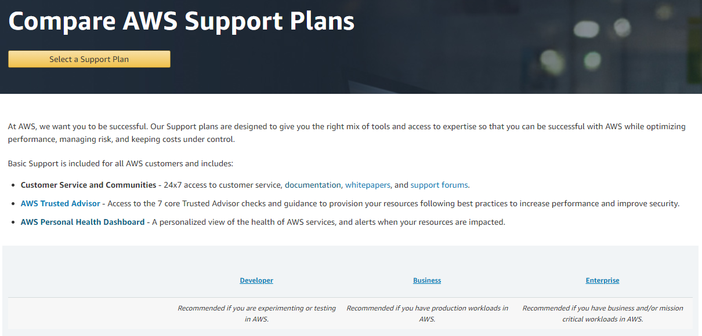
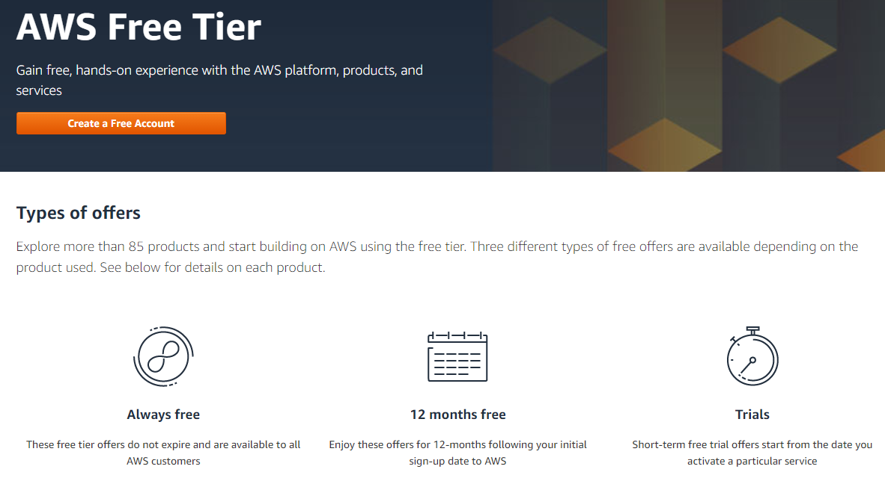
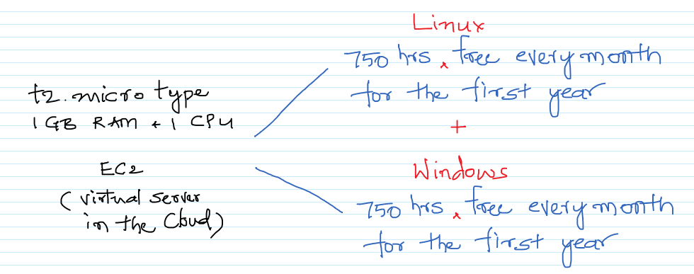
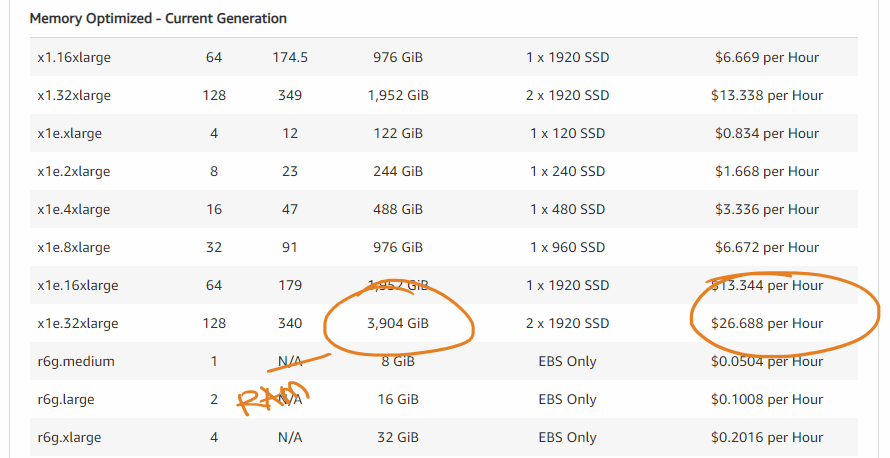
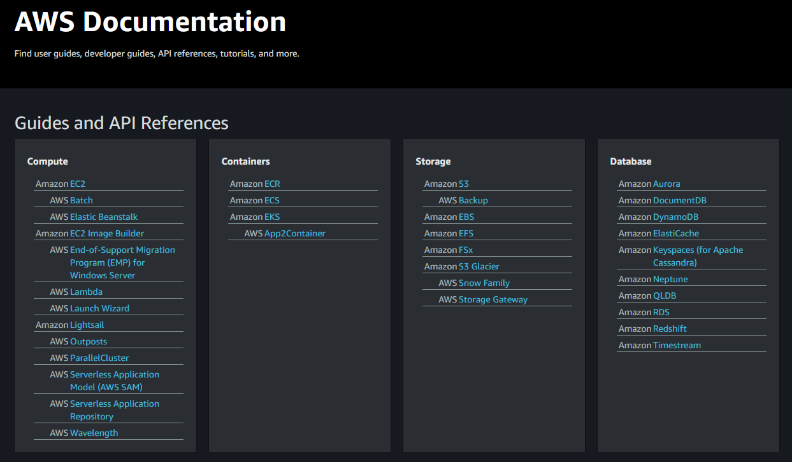
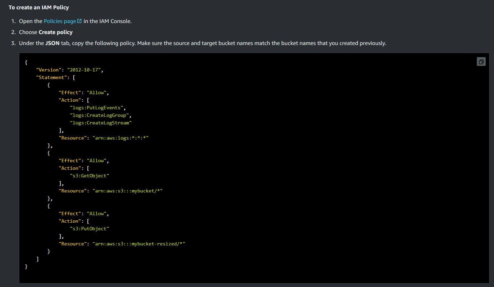
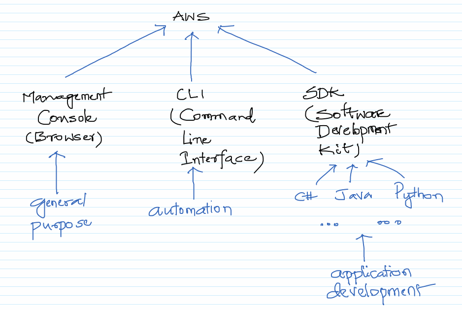
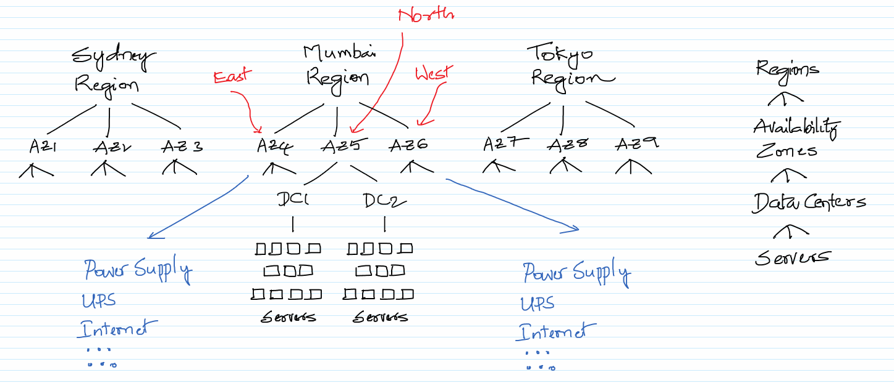
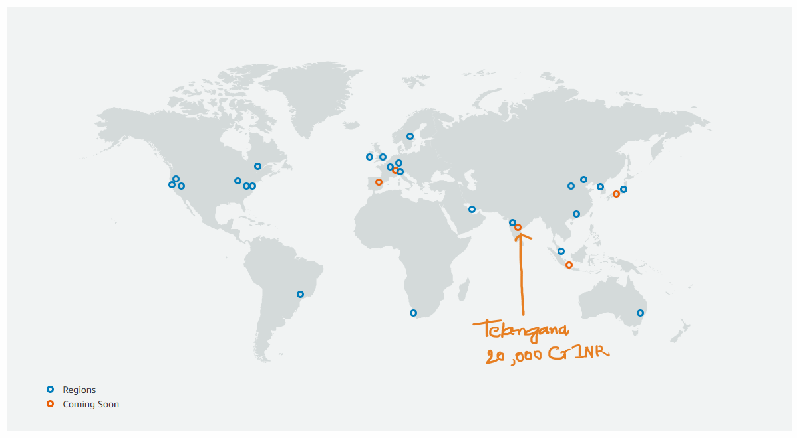

# Getting started with AWS

## Theory

1. Creating an account with AWS
1. Free Tier
1. Different ways of interacting with AWS
1. Documentation
1. Blogs
1. MOOC
1. Regions and Availability Zones

## Creating an account with AWS

All you need is access to internet, a credit/debit card and an email account to create an account with AWS. Here is the documentation from AWS on how to create an account with AWS. A small amount would be deducted from the credit/debit card just to make sure we have provided valid details. Once an AWS Account has been created, we should be able to create resources in AWS and deploy applications onto them.

https://aws.amazon.com/premiumsupport/knowledge-center/create-and-activate-aws-account/

During the account creation, make sure you select the `Basic Support` plan which comes for free and good enough for learning/getting started with AWS. When stuck technically, with this plan we won't be able to contact AWS. We need to depend on the forums like StackOverflow for any help.

https://aws.amazon.com/premiumsupport/plans/

## Free Tier

AWS provides a lot of products/services free with limited usage for us to get started with AWS.

https://aws.amazon.com/free/

Make sure what you are doing, some of the services are really expensive and the costs can easily spiral.

https://aws.amazon.com/ec2/pricing/on-demand/

## AWS Documentation

AWS provides one of the best documentation free for the different products/services.

https://docs.aws.amazon.com/

One of the cool documentation is that it can be changes if there are any bugs or any improvements to be made. AWS would be reviewing the changes to the documentation and accept them or ask for more changes.\
https://aws.amazon.com/blogs/aws/aws-documentation-is-now-open-source-and-on-github/

The below changes have been done by me to the AWS Lambda documentation to make sure that Lambda has only the required permissions and nothing more.\
https://docs.aws.amazon.com/lambda/latest/dg/with-s3-example.html

## Different ways of interacting with AWS

AWS SDK - https://aws.amazon.com/tools/  
AWS CLI - https://aws.amazon.com/cli/  
AWS Management Console - https://console.aws.amazon.com

## Blogs

AWS as a company and individuals like us provide very good blogs to get comfortable with the different concepts. Some of the interesting blogs can be found [here](AWS-blogs.md).

Use [Innoreader](https://www.inoreader.com/) for aggreating the blogs, instead of visiting the individual blogs on a regular basis.

## MOOC

AWS and others provide a good number of quality **free** courses around AWS and related technologies. Some of them can be found [here](AWS-mooc.md).

## Global Infrastructures - Regions and Availability Zones

## Practical

1. Logging to the AWS Account
1. Navigating the different screens
1. Looking at the billing