# Getting started with Elastic Load Balancer

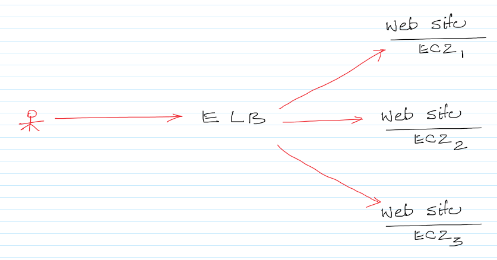

## Further Reading

1. ELB Home Page
    - https://aws.amazon.com/elasticloadbalancing/

1. ELB Documentation
    - https://docs.aws.amazon.com/elasticloadbalancing/latest/userguide/what-is-load-balancing.html

1. Different types of ELB
    - https://aws.amazon.com/elasticloadbalancing/details/#compare
    - https://www.sumologic.com/aws/elb/aws-elastic-load-balancers-classic-vs-application/
    - https://medium.com/containers-on-aws/using-aws-application-load-balancer-and-network-load-balancer-with-ec2-container-service-d0cb0b1d5ae5

## Creating a Classic ELB and observe the Round Robin Routing

1. Make sure to select the `New EC2 Experience` from the EC2 Management Console as shown below.\

1. Create a Security Group (AllowAll) with Inbound `All Protocols/Ports/Sources`. The Outbound rules can be left as default.\
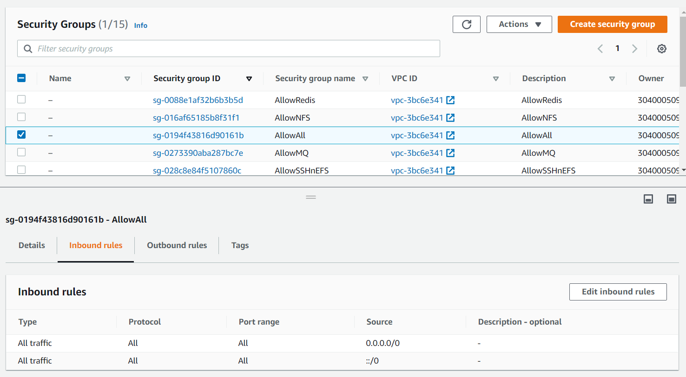
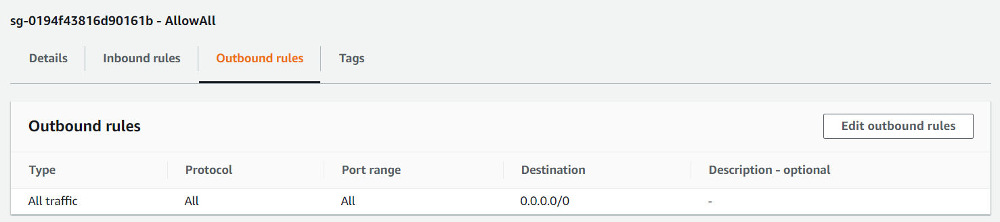

1. Create a KeyPair with private key in the `ppk` format. When prompted download the Privatekey to Laptop.\

1. Create an `EC2 Launch Template` with the below details
    - Navigate to
        - https://console.aws.amazon.com/ec2/v2/home?region=us-east-1#LaunchTemplates:
    - Click on `Create launch template`\

    - Give the Launch Template a name and description
    - `Ubuntu Server 18.04 LTS (HVM), SSD Volume Type` as the AMI. Make sure to select the one with the architecture as `64-bit (x86)` as shown below.\
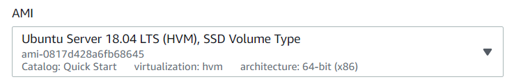
    - Instance type as `t2.medium`
    - Earlier created KeyPair
    - Earlier created SecurityGroup (AllowAll)
    - Click on `Create launch template`

1. To launch EC2 from the above template.
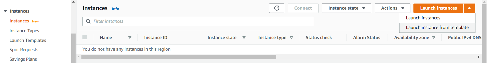

1. Grab the Public IP address of the EC2 instance.\

1. Download Putty from the below URL.\
        - https://www.chiark.greenend.org.uk/~sgtatham/putty/latest.html
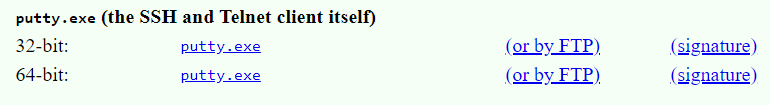

1. Open Putty and specify the username and IP as shown below.\
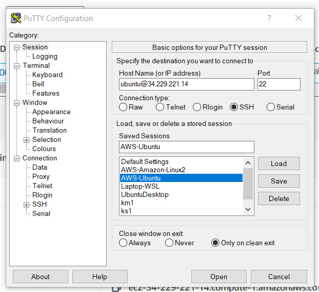

1. In Putty navigate to `Connection --> SSH --> Auth`, click on browse and point to the Keypair (ppk file).\
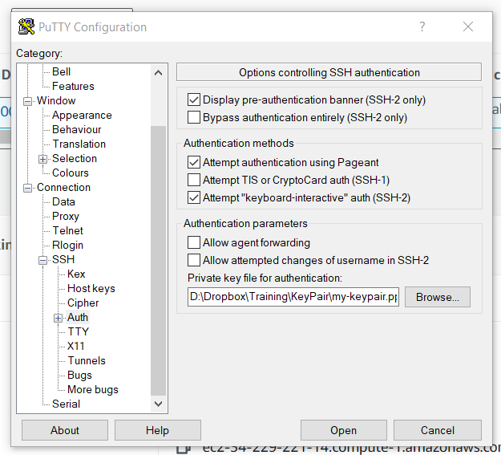

1. Click on `Connect` to establish a connection to the EC2 instance. When prompted with the security alert for the first time say `yes`. 
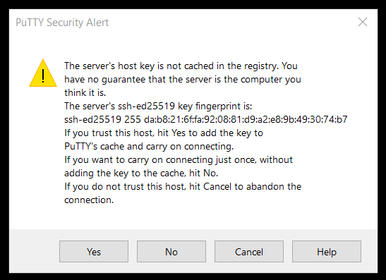

1. Execute the below commands to install the Apache2 (webserver).
    - sudo su
    - apt-get update
    - apt-get install apache2 -y
    - service apache2 start
    - cd /var/www/html
    - rm index.html

1. On the first EC2 instance execute the following command.
    -  echo "I am webserver001" > index.html

1. On the second EC2 instance execute the following command.
    -  echo "I am webserver002" > index.html

1. Make sure that the webpages are accessible via the browser using the IP address.\
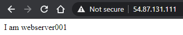\
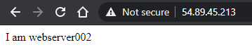

1. In the EC2 Management Console navigate to the `Load Balancers` tab and click on `Create Load Balancer`.\
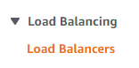\

1. Click on `Create` for the `Classic Load Balancer`.\
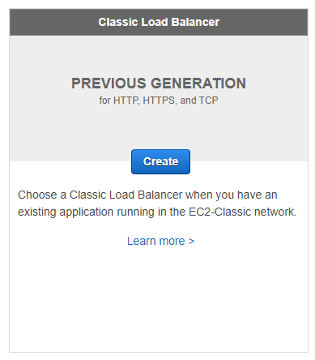

1. Give the ELB a name. Go with all the default options and click on `Next: Assign Security Groups`.\
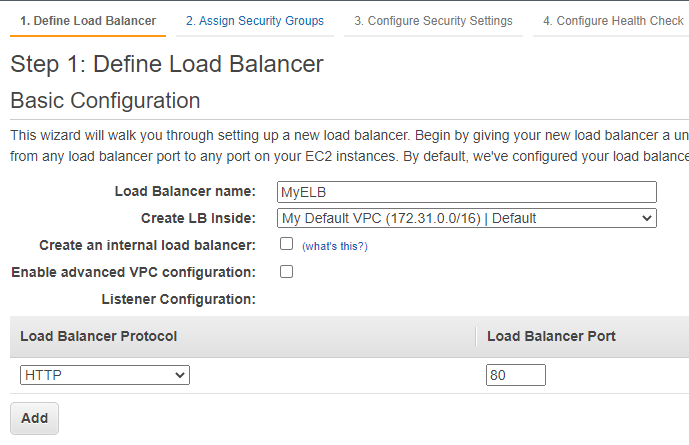

1. For the Security Groups select `AllowAll`.\
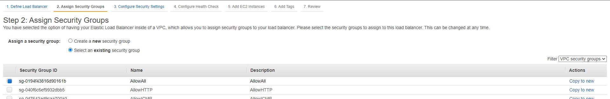

1. Ignore the warning shown below and click on `Next : Configure Health Check`.\
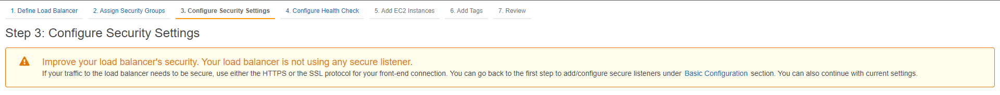

1. For the health checks, specify the options as below and click on `Next : Add EC2 instances`.`
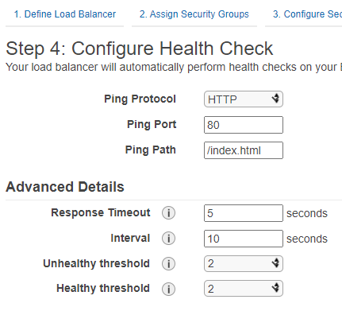

1. Select both the EC2 instances as shown below. Click on `Next: Add Tags`\
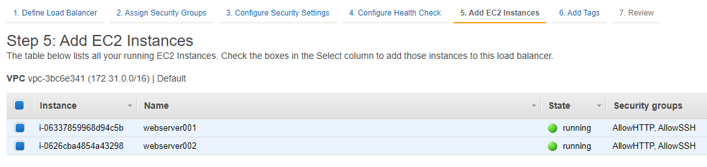

1. Tags are optional. Ignore them and click on `Review and Create`.

1. Make sure all the details are specified properly and click on `Create` to create the Load Balancer.\
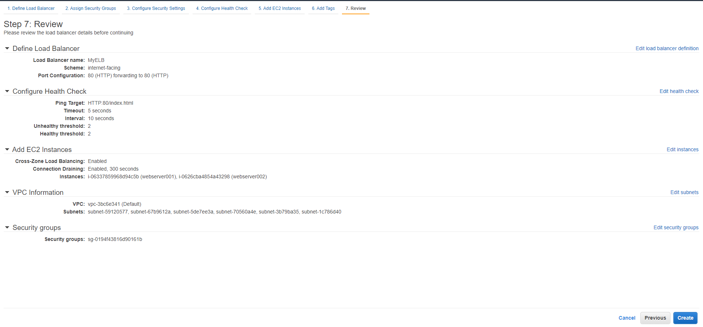

1. Note down the `DNS name` of the Load Balancer.\
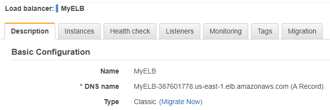

1. Go to the instances tab and make sure that both the EC2 instances are `InService` or in a `healthy` state.\
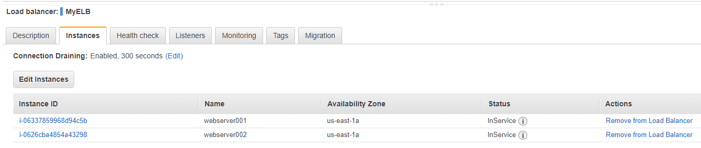

1. Enter the Load Balancer DNS name in the browser and click on the refresh button. Notice that the Load Balancer sends the requests to the EC2 in a `Round Robin` fashion.\
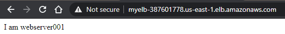

1. Make sure to delete the Load Balancer and terminate the EC2 instances.