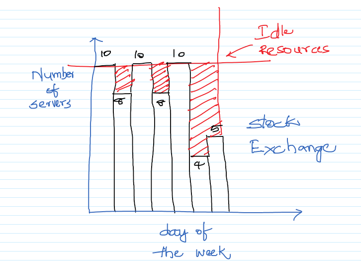
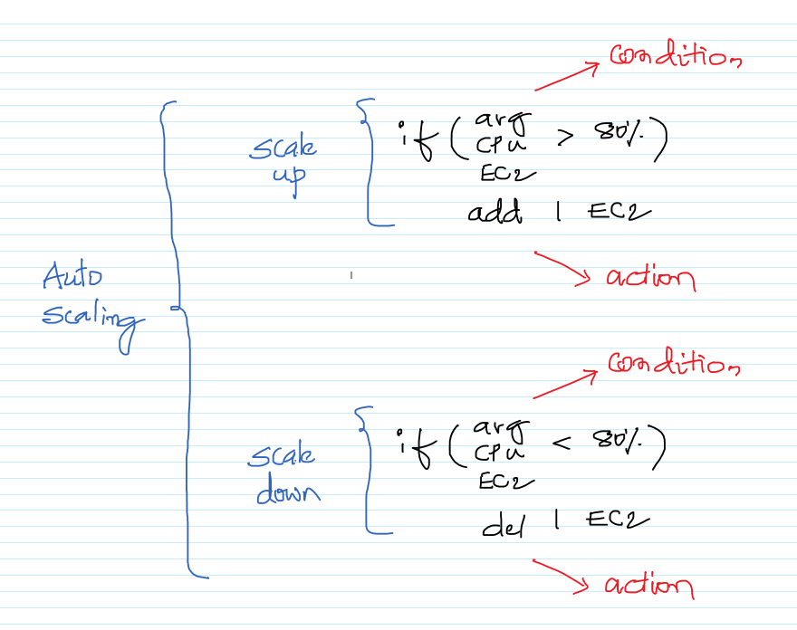
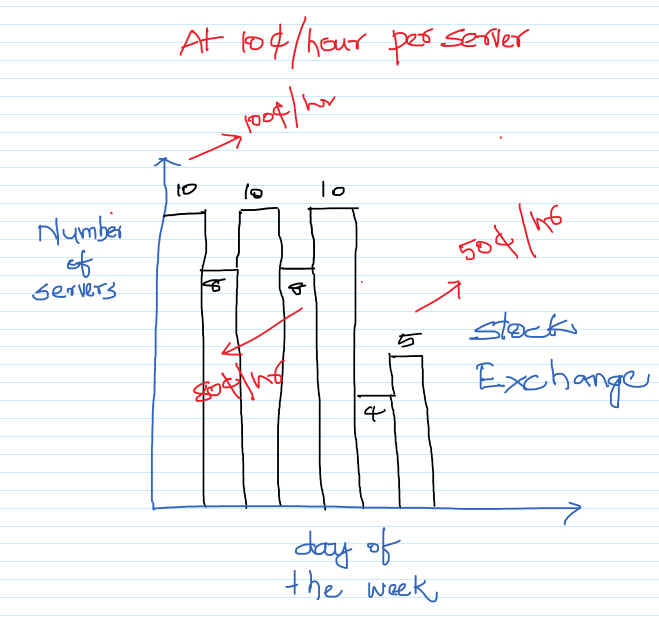

# Getting started with AutoScaling

Traditional way of doing things.\

The AutoScaling way of doing things.\

We exactly pay for what we use and it happens automatically.\

## Further Reading

1. AutoScaling Documentation
    - https://docs.aws.amazon.com/autoscaling/index.html

1. Different AutoScaling Types.
    - https://docs.aws.amazon.com/autoscaling/ec2/userguide/as-scale-based-on-demand.html#as-scaling-types

1. AutoScaling using Launch Templates.
    - https://docs.aws.amazon.com/autoscaling/ec2/userguide/LaunchTemplates.html
     -https://docs.aws.amazon.com/autoscaling/ec2/userguide/create-launch-template.html
    - https://docs.aws.amazon.com/autoscaling/ec2/userguide/create-asg-launch-template.html