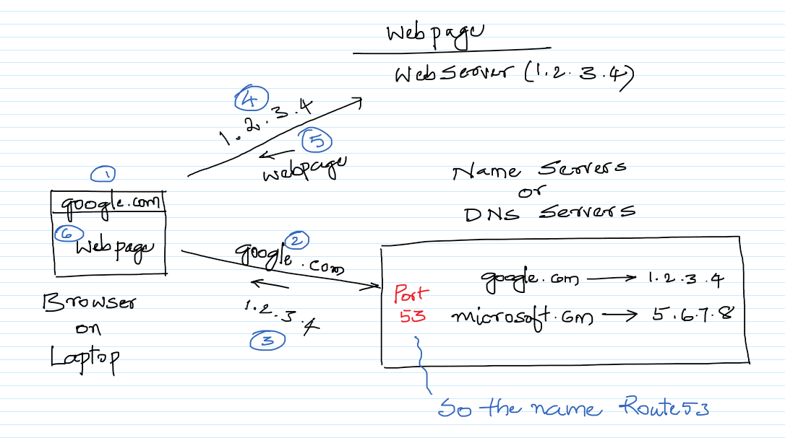

# Working with Route53

## Registration of domain

##  DNS Servers

# Further Reading

1. Route53 Home Page
    - https://docs.aws.amazon.com/Route53/latest/DeveloperGuide/Welcome.html

1. Route53 Documentation
    - https://docs.aws.amazon.com/Route53/latest/DeveloperGuide/Welcome.html

1. Registering domain names using Amazon Route 53
    - https://docs.aws.amazon.com/Route53/latest/DeveloperGuide/registrar.html