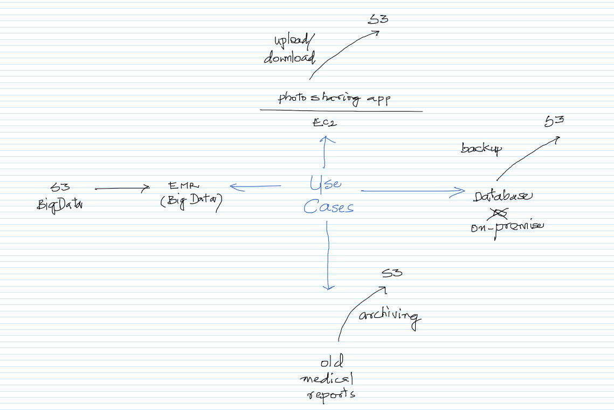
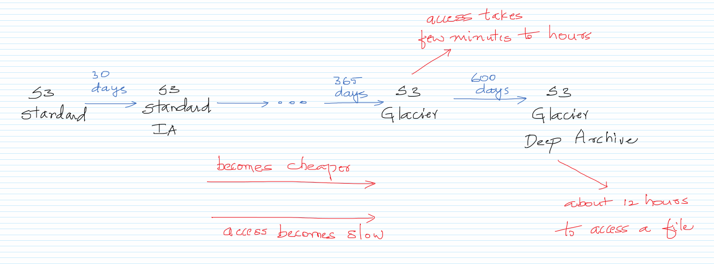
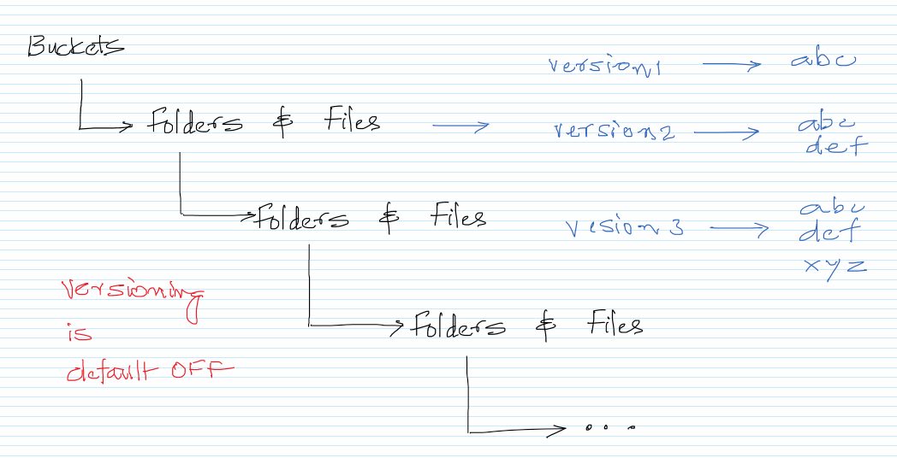
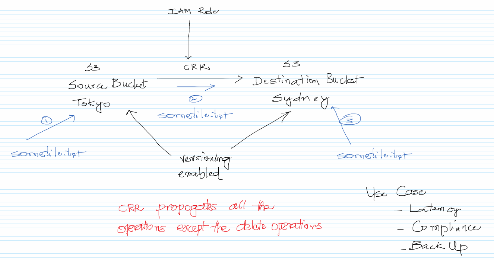
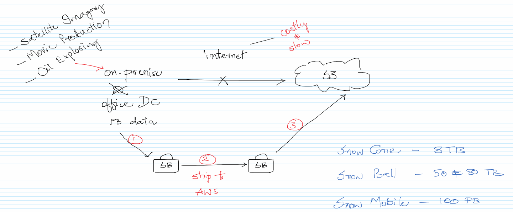

# Working with S3

## Theory

1. Use cases
1. Buckets, folders and files (with constraints)
1. Storage classes and Lifecycle Management
1. Versioning
1. Cross Region Replication
1. Snow Devices

### Use cases

### Buckets, folders and files (with constraints)

### Storage classes and Lifecycle Management
https://aws.amazon.com/s3/storage-classes/
https://docs.aws.amazon.com/AmazonS3/latest/dev/object-lifecycle-mgmt.html

### Versioning
https://docs.aws.amazon.com/AmazonS3/latest/dev/Versioning.html

### Cross Region Replication
https://docs.aws.amazon.com/AmazonS3/latest/dev/replication.html

### Snow Devices
https://aws.amazon.com/snow/  
https://www.youtube.com/watch?v=H3_ZqnqLyVo (CNBC Video)\
https://aws.amazon.com/blogs/publicsector/from-deserts-to-the-battlefield-aws-snowball-edge-brings-technology-to-the-tactical-edge/ (AWS Article)

## Practicals

1. Creating buckets and uploading files
1. Using different storage classes
1. Versioning in S3
1. Cross Region Replication

## Further Reading

1. Server Access Logs vs Object-level logging
    - https://acloud.guru/forums/aws-certified-solutions-architect-associate/discussion/-L5KnjS2mlyqPvuMu00f/Serve%20access%20logging%20vs%20Object-level%20logging

1. Requester pays
    - https://docs.aws.amazon.com/AmazonS3/latest/dev/RequesterPaysBuckets.html

1. Events
    - https://docs.aws.amazon.com/AmazonS3/latest/dev/NotificationHowTo.html

1. Static Website Hosting
    - https://docs.aws.amazon.com/AmazonS3/latest/dev/WebsiteHosting.html

1. S3 Intelligent Tiering
    - https://aws.amazon.com/about-aws/whats-new/2018/11/s3-intelligent-tiering/

1. Optimizing Amazon S3 Performance
    - https://docs.aws.amazon.com/AmazonS3/latest/dev/optimizing-performance.html