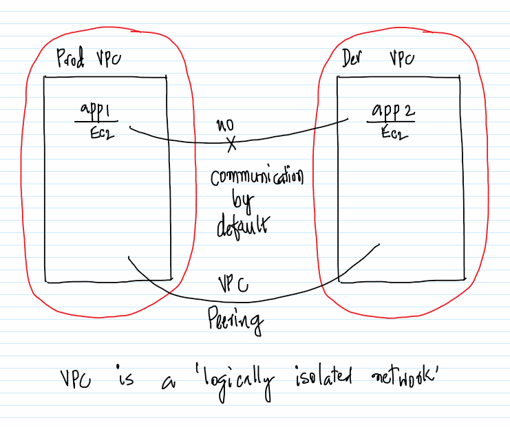
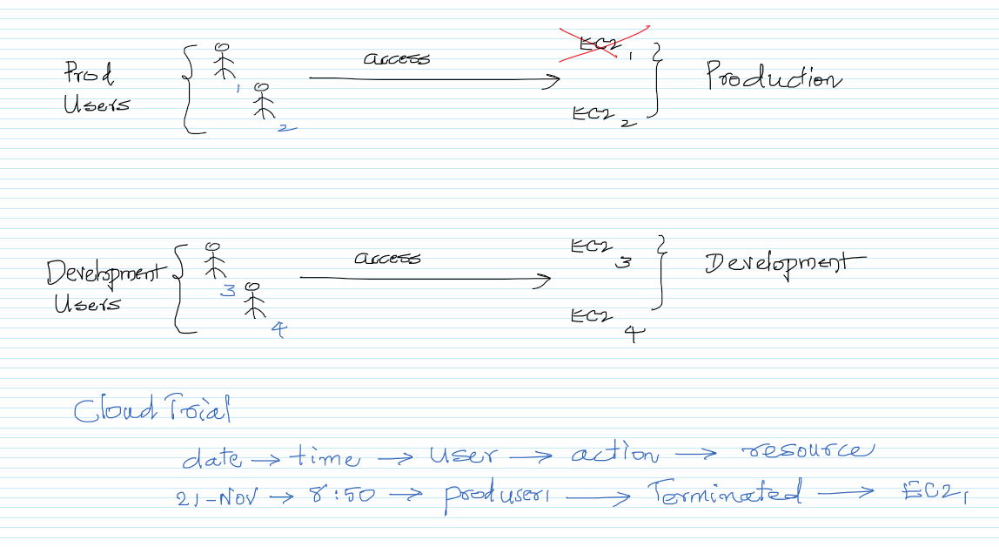
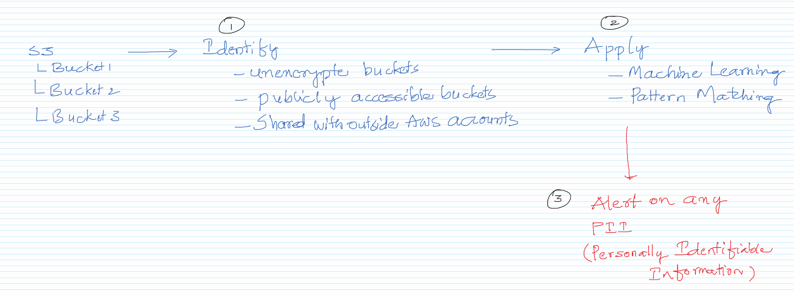
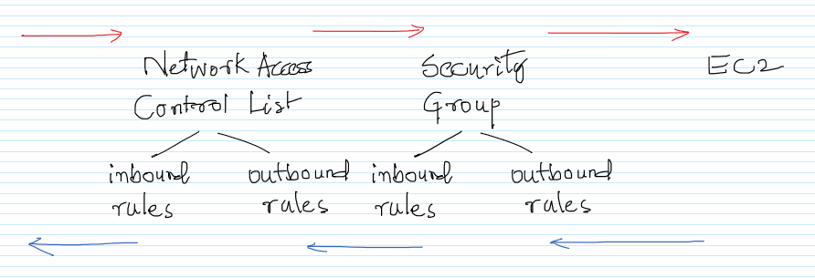
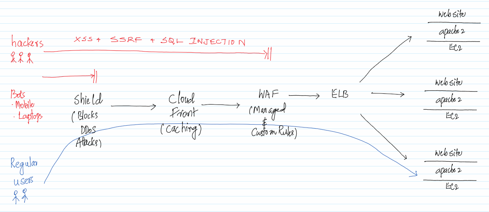
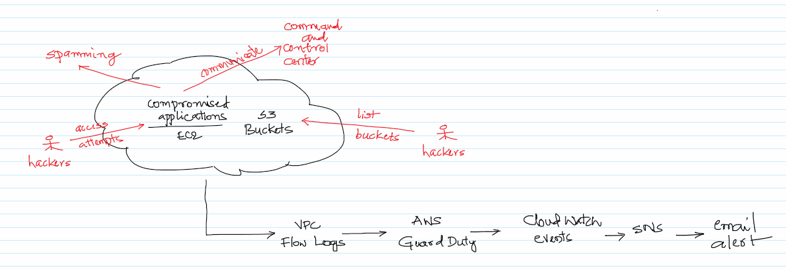

# Security and Network Management in the AWS Cloud

## Theory

1. What is VPC and it's purpose
1. Different AWS Security Services and their use cases

## What is a VPC (Virtual Private Cloud)

https://aws.amazon.com/vpc/  

## Different AWS Services

### IAM (Identify and Access Management) and CloudTrail

https://aws.amazon.com/cloudtrail/  
https://aws.amazon.com/iam/

### Macie

https://aws.amazon.com/macie/  

### Security Groups and NACL (Network Access Control List)

https://docs.aws.amazon.com/vpc/latest/userguide/VPC_Security.html#VPC_Security_Comparison

### WAF (Web Application Firewall) and Shield

https://aws.amazon.com/waf/  
https://aws.amazon.com/  

### GuardDuty

https://aws.amazon.com/guardduty/

## Practicals

1. Create an IAM User with S3 Read Only Access
1. Demo of CloudTrail
1. Demo of the Security Group