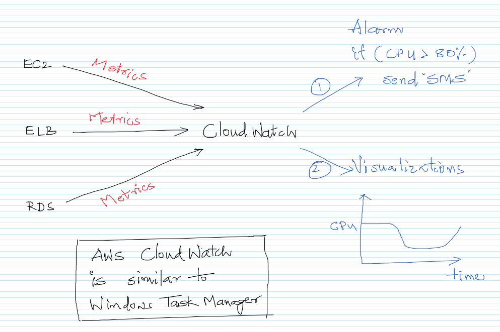
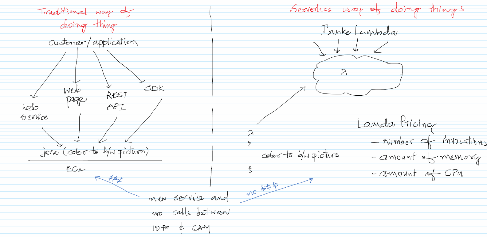
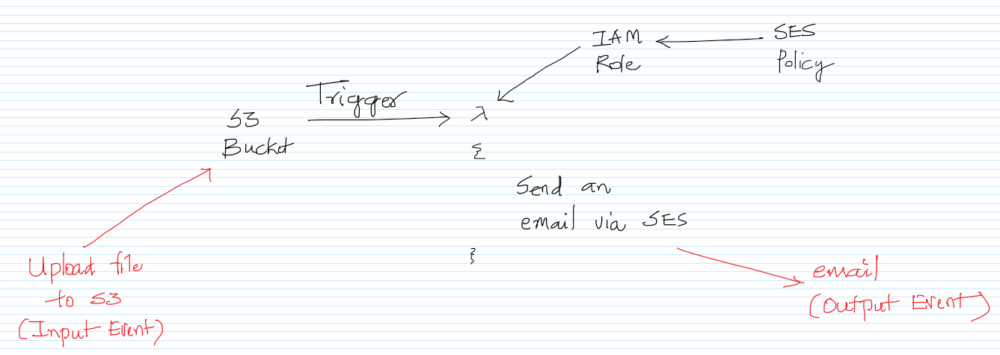
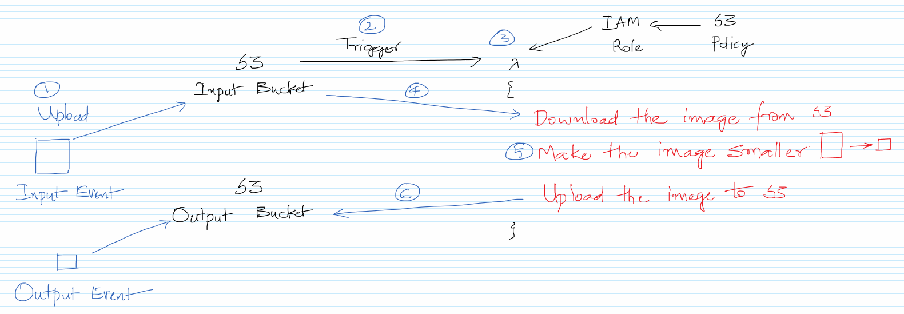

# Monitoring Services and CloudWatch

## Theory

1. What is CloudWatch?
1. What is Lambda?

## What is the purpose of CloudWatch?

https://aws.amazon.com/cloudwatch/  

1. To increase the CPU on a Linux EC2 instance. The same can be checked using the top command.
   >dd if=/dev/urandom | bzip2 -9 >> /dev/null

## The serverless way of doing things

https://aws.amazon.com/serverless/  
https://aws.amazon.com/lambda/  

## Use cases of Lambda

## Practicals

1. Creating an EC2 and see the CPU spike in CloudWatch
1. Integrate S3 with Lambda to send an email.