# WordPress Setup on AWS

1. Make sure to select the `New EC2 Experience` from the EC2 Management Console as shown below.\

1. Create a Security Group (AllowAll) with Inbound `All Protocols/Ports/Sources`. The Outbound rules can be left as default.\

1. Create a KeyPair with private key in the `ppk` format. When prompted download the Privatekey to Laptop.\
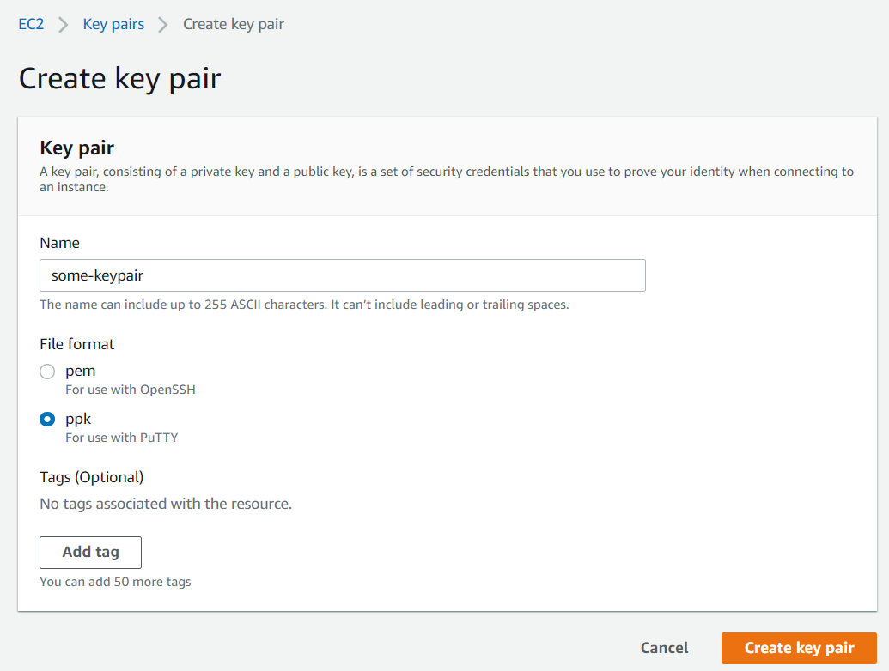

1. Create an `EC2 Launch Template` with the below details
    - Navigate to
        - https://console.aws.amazon.com/ec2/v2/home?region=us-east-1#LaunchTemplates:
    - Click on `Create launch template`\
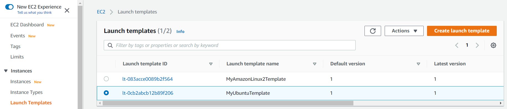
    - Give the Launch Template a name and description
    - `Ubuntu Server 18.04 LTS (HVM), SSD Volume Type` as the AMI. Make sure to select the one with the architecture as `64-bit (x86)` as shown below.

    - Instance type as `t2.medium`
    - Earlier created KeyPair
    - Earlier created SecurityGroup (AllowAll)
    - Click on `Create launch template`

1. To launch EC2 from the above template.

1. Grab the Public IP address of the EC2 instance.\
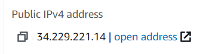

1. Download Putty from the below URL.\
        - https://www.chiark.greenend.org.uk/~sgtatham/putty/latest.html

1. Open Putty and specify the username and IP as shown below.\

1. In Putty navigate to `Connection --> SSH --> Auth`, click on browse and point to the Keypair (ppk file).\

1. Click on `Connect` to establish a connection to the EC2 instance. When prompted with the security alert for the first time say `yes`. 

	
1. Navigate to the RDS Management Console.
   - https://console.aws.amazon.com/rds/home?region=us-east-1

1. Click on `Create database`.\
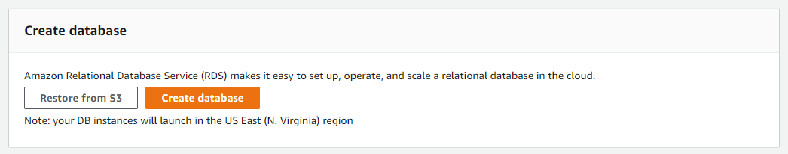

1. Select `MySQL` for the `Engine options`.\
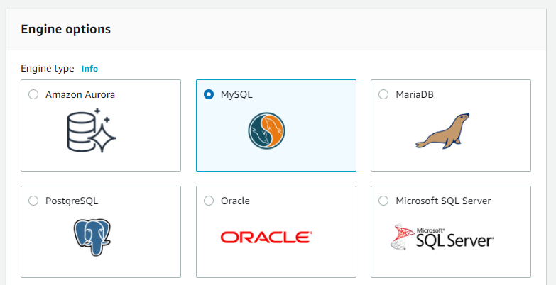

1. For the templates select `Free Tier`.\
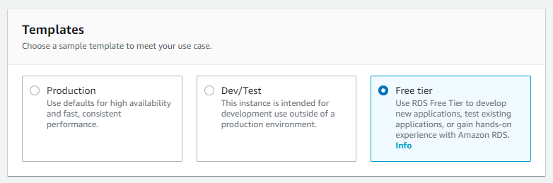

1. Under the settings specify the password twice.\
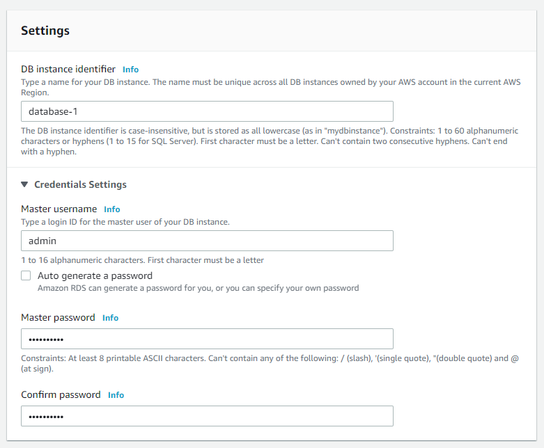

1. For the `db-instance-size` select `t2.micro`.\

1. Under the `storage` disable `Storage-autoscaling`.\
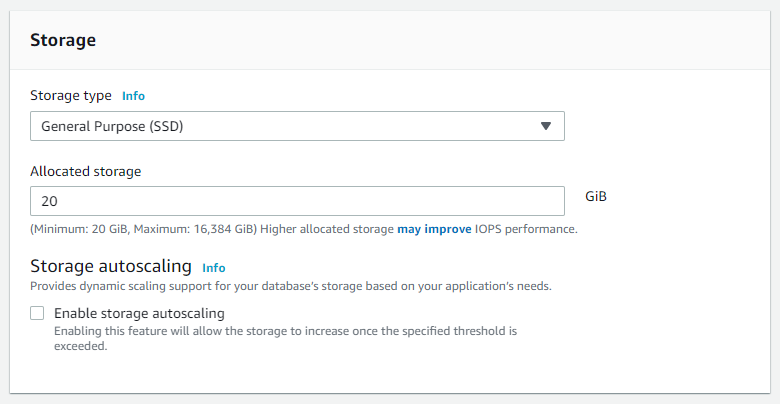

1. Under `Connectivity` for `Public access` select `Yes`.\
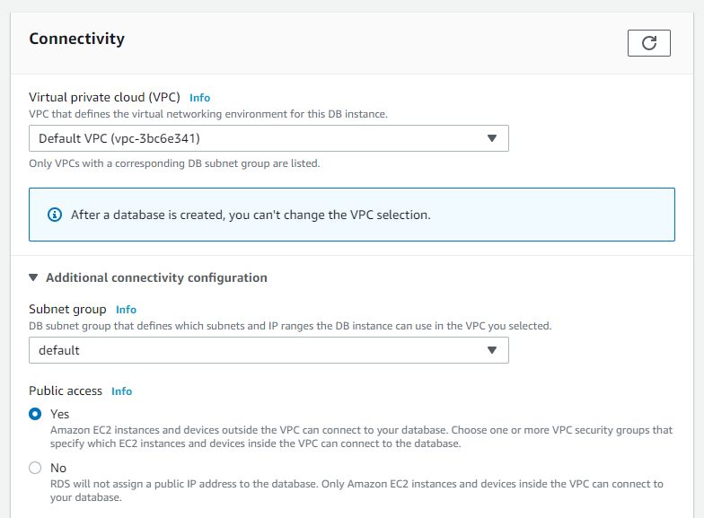

1. For the Security Group, select `AllowAll`.\
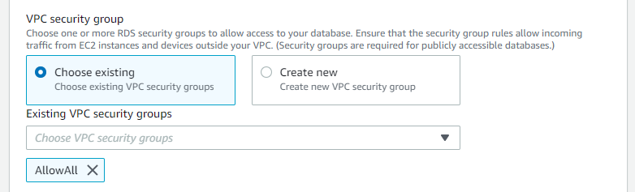

1. Under `Additional configuration` specify the `Initial database name` as `wordpress`.\
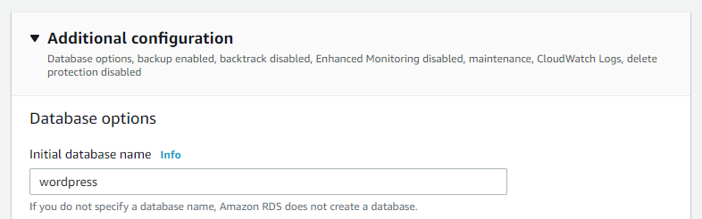

1. Disable the Backups.\
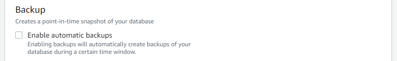

1. Click on `Create database`.

1. The RDS database would be created as shown in a few minutes.\
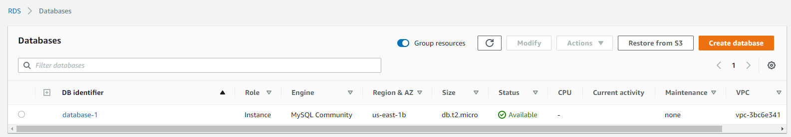

1. Note down the RDS endpoint.\
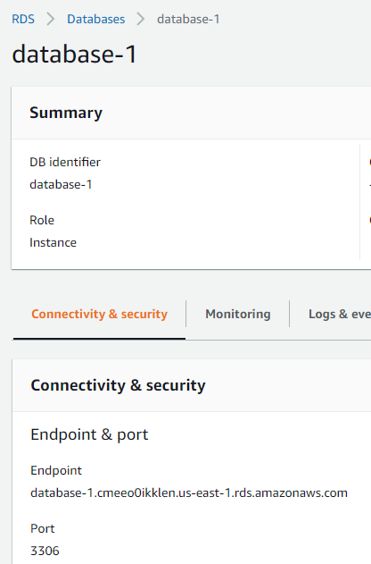

1. Execute the commands on the EC2. Become a root.
   >sudo su 

1. Putty into the EC2 instance and execute the below commands to install the prerequisies for WordPress.
   >apt-get update
   >apt-get install apache2 php php-mysql php-curl mysql-client libapache2-mod-php unzip -y

1. Again in Putty execute the below commands to download and extract the latest WordPress.
   >cd /var/www/
   >wget https://wordpress.org/latest.zip
   >unzip latest.zip

1. Make a copy of the wp-config-sample.php file as wp-config.php in Putty.
   >cd wordpress
   >cp wp-config-sample.php wp-config.php
		
1. Modify the wp-config.php to include the database details. The localhost should be replaced with the endpoint of the RDS database instance. Use the vi editor for the same.	
   >define('DB_NAME', 'database_name_here');
   >define('DB_USER', 'username_here');
   >define('DB_PASSWORD', 'password_here');
   >define('DB_HOST', 'localhost');
		
1. By default the webserver expects the web pages in the /var/www/html folder, but the WordPress has been installed in the /var/www/wordpress folder. Modify the 000-default.conf file in the /etc/apache2/sites-enabled folder to change the DocumentRoot to /var/www/wordpress.
		
1. For the changes to take effect the apache web server has to be restarted. Execute the below command.
	>service apache2 restart
		
1. (Optional) All the wordpress files belong to the root user and group. Change the permissions using the chown command.
	>chown -R www-data:www-data /var/www/wordpress
		
1. Access the WordPress using the below URL in a browser. Note to replace the ip address in the URL with public ip address of the EC2.
	>http://52.90.49.139/wp-admin/install.php
		
1. Complete the WordPress installation by following the instructions in the browser.

1. Once the installation is complete, log in to the WordPress and publish a new post.

1. A blog would be created as shown below.\
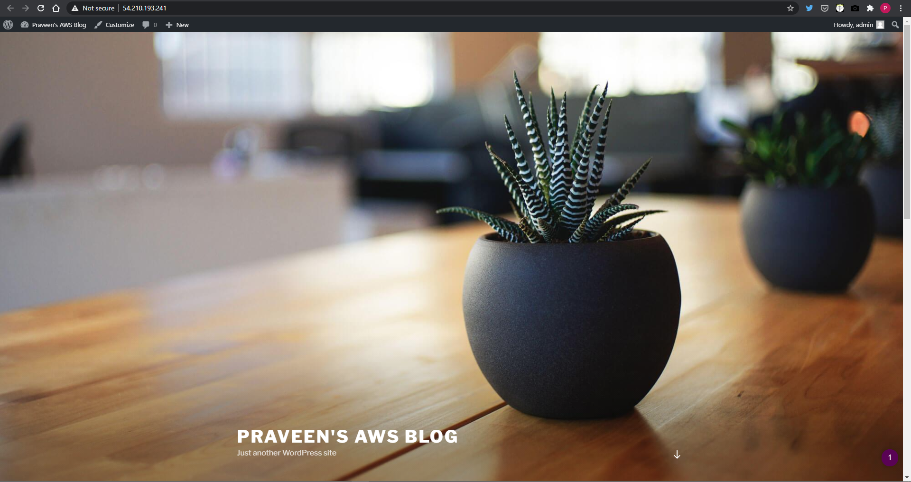

## Additional tasks 

1. Create an ANAME record for the EC2 public ip address in the Route53 service. Now the WordPress blog can be accessed by using a user friendly URL. For this a domain needs to be registered.

1. Change the DB to multi AZ HA mode.

1. Create an EFS and attach it to Ubuntu instance (/var/www/wordpress/wp-content/uploads). Make sure all the WordPress media files go into the EBS folder.

1. Creating an AutoScaling WebSite along with ELB.

1. Create a highly available website by using ELB.
		
1. Use CloudFormation for automation.
