# AutoScaling with EC2

1. Create an Launch Template for Ubuntu EC2 with the detailed monitoring enabled under the `Advanced details`. Make sure to select the Keypair and the Security Group which will allow the SSH traffic inbound\
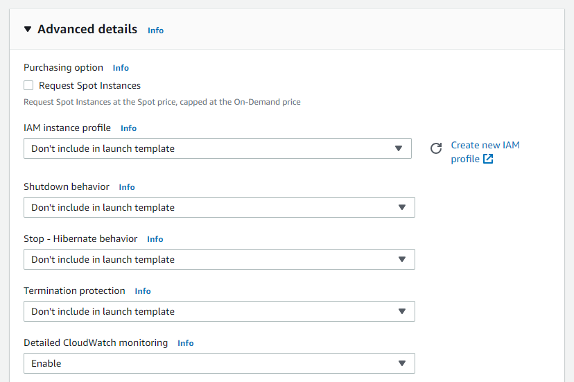

1. Under the EC2 Management Console, navigate to `Auto Scaling Groups` and click on `Create Auto Scaling group`.\
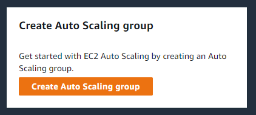

1. Give the Auto Scaling Group a name and select the template created in the previous step. Click on `Next`.\
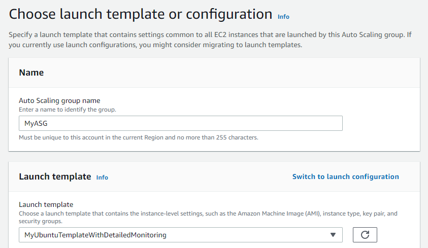

1. Under the `Configure settings`, select all the `Subnets`. Click on `Next`.\
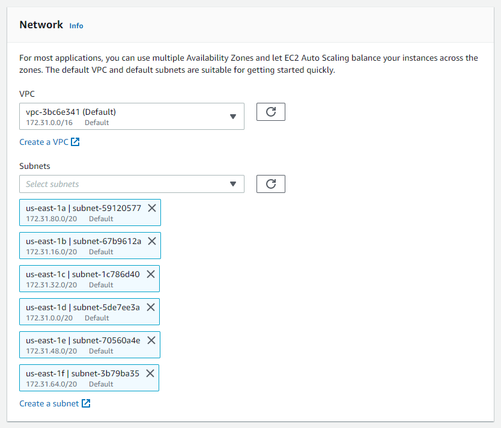

1. Go with the default options for `Configure advanced options`. Click on `Next`.\

1. Under the `Configure group size and scaling policies`, specify the `Group size as below`. Select `None` for `Scaling policies`. Click on `Next`.\
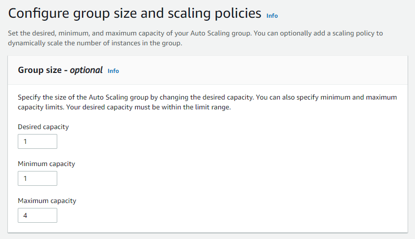

1. Click on `Next` under the `Add notifications`.

1. Click on `Next` under the `Add tags`.

1. Review all the details and click on `Create Auto Scaling group`.

1. Under the `Instance management` there should be an EC2 instance as shown below.\
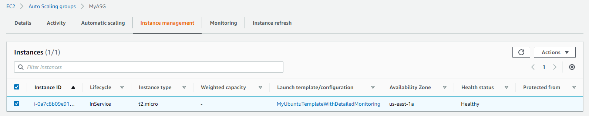

1. Go to the `Automatic scaling` tab and click on `Add policy`.\
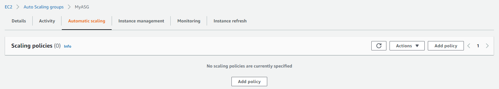

1. Select `Simple scaling` and give the policy a name.\
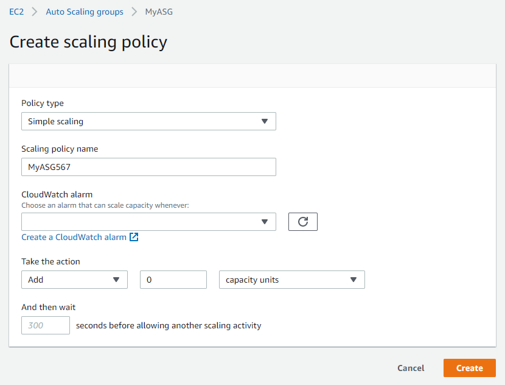

1. In the same screen click on `Create a CloudWatch alarm` to open a new IAM tab.

1. Click on `Select metric`. Select `EC2`. Select `By Auto Scaling Group`.

1. For the Auto Scaling Group created earlier, select `CPU Utilization`. Click on `Select metric`.\
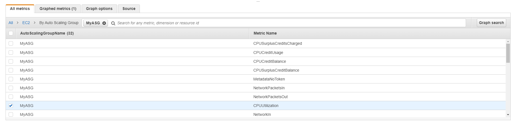

1. Specify the metrics and conditions as shown below. Click on `Next`\
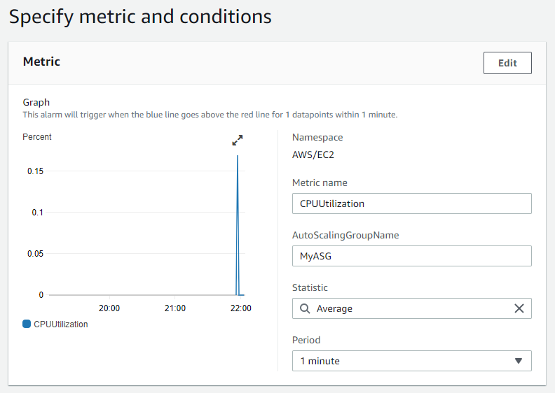
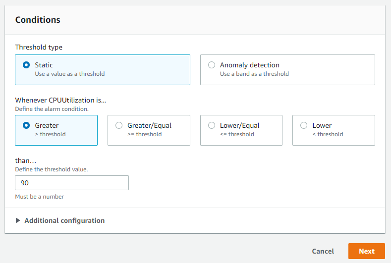

1. Under the `Configure actions` click on `Remove`. Click on `Next`.\
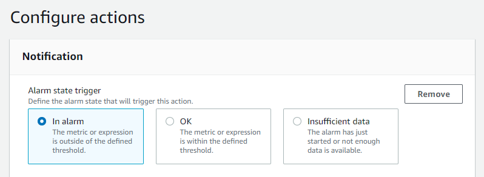

1. Give the Alarm a name and description. Click on `Next`.\
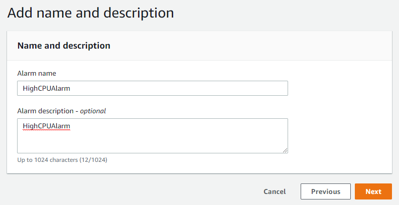

1. Click on `Create alarm`. Close the tab.

1. Click on the refresh button and select the `CloudWatch alarm`. Also, specify the action as shown below. Click on `Create`.\
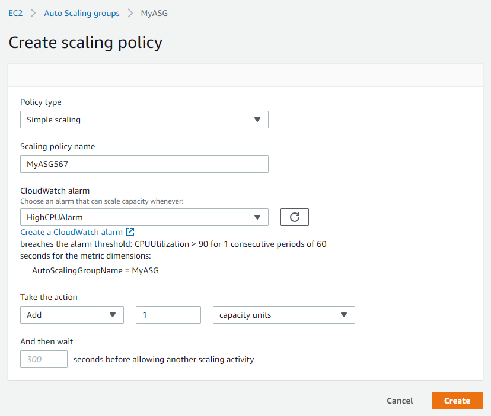

1. The Scaling policy should be created as shown below.\
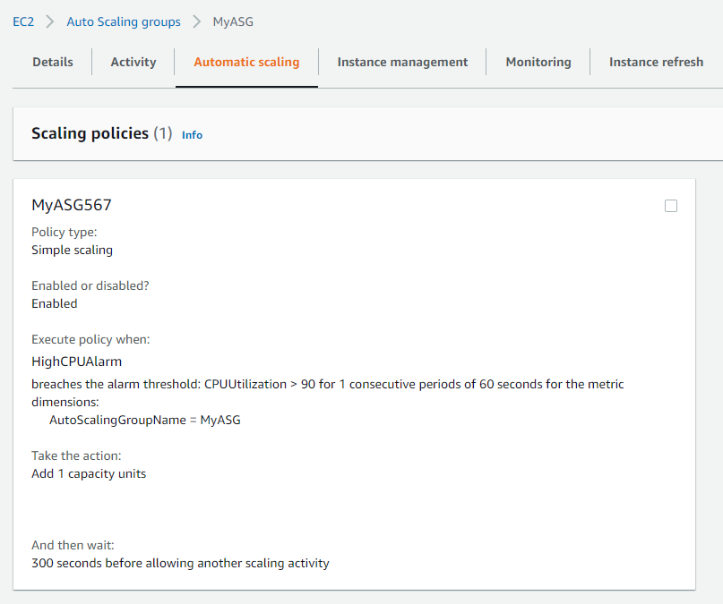

1. Grab the `Public IP` of the EC2 instance and connect to it via Putty.

1. Run the below command on the EC2 to increase the CPU utilization.
    >dd if=/dev/urandom | bzip2 -9 >> /dev/null

1. Because of the High CPU on the EC2, another EC2 would be automatically added. The same can be noticed in the Auto Scaling Group.\
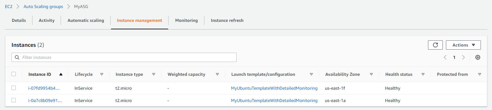

1. Delete the Auto Scaling Group and the EC2 instances would be automatically terminated.\
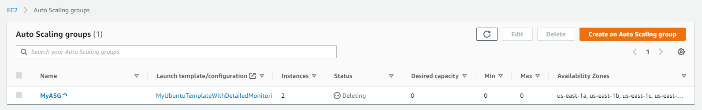
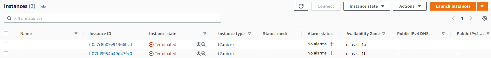